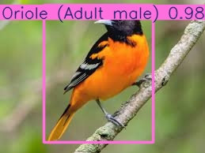

# Bird Species Detection with YOLOv8

** [Try the Live Demo](https://bird-camera-cdp4j7hnunww5vie2ty4fa.streamlit.app/)** | **📊 [View Results](#results)** | **🛠️ [Technical Details](#technical-stack)**

[](https://bird-camera-cdp4j7hnunww5vie2ty4fa.streamlit.app/)


An end-to-end machine learning project for real-time bird species detection and classification using YOLOv8, trained on AWS SageMaker GPU infrastructure.


---

## Project Overview

This project demonstrates a complete ML pipeline from data preparation to deployment:

- **Dataset:** NABirds (555 North American bird species)
- **Model:** YOLOv8 
- **Training:** 50 epochs on AWS SageMaker ml.g4dn.xlarge GPU
- **Deployment:** Streamlit Cloud with automatic model downloading
- **Performance:** 97%+ confidence on test images, ~300ms inference time

### Key Features
- ✅ Real-time bird detection with bounding boxes
- ✅ Species classification across 555 bird types
- ✅ Web-based interface for easy testing
- ✅ Drag-and-drop image upload
- ✅ Confidence scores for each detection

---

## Quick Start

### Option 1: Use the Live Web App
Simply visit [the deployed app](https://bird-camera-cdp4j7hnunww5vie2ty4fa.streamlit.app/) and upload a bird image!

### Option 2: Run Locally
```bash
# Clone the repository
git clone https://github.com/nico-mannarelli/bird-camera.git
cd bird-camera

# Install dependencies
pip install -r requirements.txt

# Run the Streamlit app
streamlit run app.py
```

The model will automatically download from Google Drive on first run (~23MB).

### Option 3: Command Line Inference
```bash
# Detect birds in a single image
python inference.py --image path/to/bird.jpg

# Adjust confidence threshold
python inference.py --image bird.jpg --conf 0.5
```

---

## Results

### Training Performance

| Metric | Value |
|--------|-------|
| Final Loss | 0.655 |
| mAP@50 | 0.699 |
| mAP@50-95 | 0.531 |
| Precision | 0.633 |
| Recall | 0.632 |
| Training Time | 11 hours |
| Epochs | 50 |

### Example Detections

**Bullock's Oriole Detection:**
- Species: Bullock's Oriole (Adult male)
- Confidence: 97.7%
- Inference Time: 309ms


[Add more example images here]

---

## Technical Stack

### Machine Learning
- **Framework:** PyTorch 2.0
- **Model:** YOLOv8n (Nano - optimized for speed)
- **Training:** Ultralytics library
- **Input Size:** 640x640 pixels
- **Batch Size:** 16

### Cloud Infrastructure
- **Platform:** AWS SageMaker
- **Instance Type:** ml.g4dn.xlarge (NVIDIA T4 GPU, 16GB GPU memory)
- **Storage:** Amazon S3 for datasets and model artifacts
- **Cost:** ~$8 for full training run (11 hours × $0.70/hour)

### Deployment
- **Web Framework:** Streamlit
- **Hosting:** Streamlit Cloud (free tier)
- **Model Storage:** Google Drive (with gdown for automatic downloading)
- **CI/CD:** Automatic deployment on git push

### Development Tools
- **Version Control:** Git & GitHub
- **Notebook:** Jupyter (for exploration)
- **Package Management:** pip

---

## Project Structure
```
bird-camera/
├── app.py                          # Streamlit web application
├── inference.py                    # Command-line detection script
├── train.py                        # SageMaker training script
├── requirements.txt                # Python dependencies
├── README.md                       # Project documentation
├── LICENSE                         # MIT License
│
├── bird_detection/                 # Training outputs
│   ├── results.png                 # Training curves
│   ├── confusion_matrix.png        # Model confusion matrix
│   ├── results.csv                 # Detailed metrics
│   └── weights/
│       └── best.pt                 # Trained model (23MB)
│
└── [test images]                   # Sample bird images
```

---

## Methodology

### 1. Data Preparation
- Downloaded NABirds dataset
- Converted annotations from original format to YOLO format
- Split into training/validation sets
- Uploaded to S3 bucket for SageMaker access

### 2. Model Training
```python
# Key training parameters
model = YOLO('yolov8n.pt')
results = model.train(
    data='dataset.yaml',
    epochs=50,
    imgsz=640,
    batch=16,
    device=0  # GPU
)
```

- Used transfer learning from pre-trained YOLOv8 weights
- Trained for 50 epochs with early stopping (patience=10)
- Monitored loss, mAP, precision, and recall

### 3. Deployment Pipeline
1. Model trained on SageMaker → saved to S3
2. Downloaded and packaged model weights
3. Created Streamlit web interface
4. Deployed to Streamlit Cloud
5. Model auto-downloads from Google Drive on first run

---

## What I Learned

### Technical Skills
- **AWS SageMaker:** Setting up training jobs, managing compute resources, S3 integration
- **Computer Vision:** Object detection, YOLO architecture, transfer learning, evaluation metrics
- **MLOps:** Model versioning, deployment strategies, serving ML models at scale
- **Web Development:** Building interactive ML demos with Streamlit
- **Cloud Deployment:** Handling large model files, optimizing cold starts

### Engineering Practices
- Training models on cloud GPU infrastructure
- Managing costs in AWS ($8 for complete training)
- Handling large files in version control (Git LFS, external hosting)
- Creating user-friendly interfaces for ML models
- Writing production-ready code with error handling

---

## Future Improvements

- [ ] Add batch processing for multiple images
- [ ] Implement video detection (real-time from webcam)
- [ ] Fine-tune on specific geographic regions
- [ ] Add confidence threshold slider in UI
- [ ] Deploy as REST API with FastAPI
- [ ] Add model quantization for faster inference
- [ ] Implement A/B testing for model versions
- [ ] Add user analytics and feedback collection
- [ ] Mobile app version (iOS/Android)
- [ ] Integration with bird identification databases (eBird, Cornell Lab)

---

## Acknowledgments

- **NABirds Dataset:** Van Horn et al.
- **Ultralytics YOLOv8:** For the excellent object detection framework
- **AWS:** For SageMaker credits and infrastructure
- **Streamlit:** For free hosting and great documentation

---

## Contact

**Nico Mannarelli**
- GitHub: [@nico-mannarelli](https://github.com/nico-mannarelli)
- LinkedIn: [www.linkedin.com/in/nico-mannarelli]
- Email: [nicomannarelli@gmail.com]

---

## License

This project is licensed under the MIT License - see the [LICENSE](LICENSE) file for details.

---

## Star This Repo

If you found this project helpful or interesting, please consider giving it a star! It helps others discover the project.
